# IntelliX Engineering Plugin — Documentação Completa do Workflow

**Versão:** 3.0  
**Organização:** IntelliX.AI  
**Última atualização:** 2026-05-21  
**Confidencial — uso interno**

---

## Índice

1. [O que é o IntelliX Plugin](#1-o-que-é-o-intellix-plugin)
2. [Visão Geral do Workflow](#2-visão-geral-do-workflow)
3. [Fluxograma Completo](#3-fluxograma-completo)
4. [Etapas em Detalhe](#4-etapas-em-detalhe)
5. [Gates de Aprovação (Milestones)](#5-gates-de-aprovação-milestones)
6. [Skills e Quando São Chamadas](#6-skills-e-quando-são-chamadas)
7. [Tipos de Projeto e Atalhos](#7-tipos-de-projeto-e-atalhos)
8. [Referências Técnicas](#8-referências-técnicas)

---

## 1. O que é o IntelliX Plugin

O **IntelliX Engineering Plugin** é o método oficial de desenvolvimento de soluções digitais da IntelliX.AI. É um conjunto de fases, skills e checkpoints que garante que qualquer projeto — de uma landing page simples a um sistema completo com CRM, agentes de IA e WhatsApp — seja desenvolvido com a mesma qualidade, consistência e previsibilidade de um time sênior com décadas de experiência.

### Princípios fundamentais

| Princípio | Descrição |
|-----------|-----------|
| **Arquitetura antes de código** | Nunca se escreve uma linha de código antes de validar a arquitetura |
| **Gates obrigatórios** | O cliente aprova cada fase antes de avançar — sem surpresas |
| **Skills especializadas** | Cada fase usa ferramentas específicas — não há improvisação |
| **Memória institucional** | O contexto do projeto é preservado entre sessões e versões |
| **Qualidade industrial** | 3 camadas de revisão por arquivo antes de concluir |

---

## 2. Visão Geral do Workflow

O workflow completo tem **3 grandes etapas** e **10 fases de execução**:

```
ETAPA 1 — PRÉ-DESENVOLVIMENTO
  └─ Validação da ideia → PRD completo → Stress-test → Plano aprovado

ETAPA 2 — PLANEJAMENTO
  └─ Plano estruturado com tasks, dependências e critérios de sucesso

ETAPA 3 — EXECUÇÃO COM INTELLIX PLUGIN
  ├─ FASE 00 — Project Kickoff
  ├─ FASE 01 — Architecture
  ├─ FASE 02 — Frontend Design
  ├─ FASE 03 — Agent Creation
  ├─ FASE 04 — Dev Standards
  ├─ FASE 04b — Implementação (Epic Workflow)
  ├─ FASE 05 — Integration
  ├─ FASE 06 — Security & LGPD
  ├─ FASE 07 — Test E2E
  ├─ FASE 08 — Deploy
  └─ FASE 09 — Handoff
```

---

## 3. Fluxograma Completo

```mermaid
flowchart TD
    START([💡 IDEIA DO CLIENTE]) --> DIAG

    subgraph PRE["ETAPA 1 — PRÉ-DESENVOLVIMENTO"]
        DIAG[Diagnóstico IntelliX\nColeta de requisitos do cliente] --> BRAIN
        BRAIN["🧠 superpowers:brainstorming\nValidação da ideia\nRiscos e oportunidades"] --> PRD
        PRD["📋 ai-project-brainstorm\nPRD completo\nPersonas · Features · Stack · Roadmap"] --> GRILL
        GRILL{"Projeto de alto risco\nou muitas incógnitas?"}
        GRILL -- Sim --> GRILLME["🔥 grill-me\nStress-test do PRD\nQuestiona cada decisão"]
        GRILL -- Não --> GATE1
        GRILLME --> GATE1
    end

    GATE1{{"🚦 GATE 1\nCliente aprova o PRD"}}
    GATE1 -- Reprovado → ajusta --> PRD
    GATE1 -- Aprovado ✅ --> PLAN

    subgraph PLANNING["ETAPA 2 — PLANEJAMENTO"]
        PLAN["📐 superpowers:writing-plans\nPlano de implementação\nTasks · Dependências · Riscos · Critérios"]
    end

    PLAN --> GATE2
    GATE2{{"🚦 GATE 2\nCliente aprova o Plano"}}
    GATE2 -- Reprovado → ajusta --> PLAN
    GATE2 -- Aprovado ✅ --> F00

    subgraph EXEC["ETAPA 3 — EXECUÇÃO"]

        subgraph F00["FASE 00 — Project Kickoff"]
            PK["intellix:project-kickoff\nScaffolding · CLAUDE.md · AGENTS.md\n.intellix-phase · settings.json"]
        end

        subgraph F00B["FASE 00b — Code Audit (projetos existentes)"]
            CA["intellix:code-audit\nGap analysis · Score · Plano de refatoração"]
        end

        PK --> F01_CHECK{"Projeto existente?"}
        F01_CHECK -- Sim --> CA
        F01_CHECK -- Não --> F01
        CA --> F01

        subgraph F01["FASE 01 — Architecture"]
            ARCH["intellix:architecture\nSchema Supabase + RLS\nRotas Next.js · TypeScript types\nRepository + Service pattern\nRBAC · RFC 7807"]
        end

        F01 --> F02_CHECK{"Tem interface\nde usuário?"}

        subgraph F02["FASE 02 — Frontend Design"]
            FD1["vibestack-architect\nEstrutura de componentes"]
            FD2["ui-ux-pro-max\nDesign system conceitual"]
            FD3["design-system-patterns\nTokens CSS · Tailwind · Dark mode"]
            FD4["frontend-design-pro\nImplementação UI $50k quality"]
            FD5["impeccable\nPolish · Animações · Anti-AI-slop"]
            FD6["ckm-ui-styling\nShadcn/UI · Loading/Error states"]
            FD7["web-design-guidelines\naccessibility · seo"]
            FD1 --> FD2 --> FD3 --> FD4 --> FD5 --> FD6 --> FD7
        end

        F02_CHECK -- Sim --> FD1
        F02_CHECK -- Não --> F03_CHECK
        FD7 --> F03_CHECK

        subgraph F03["FASE 03 — Agent Creation"]
            AC["intellix:agent-creation\nGPT Maker · n8n · Blueprint v2"]
        end

        F03_CHECK{"Tem agentes\nou automação IA?"}
        F03_CHECK -- Sim --> AC
        F03_CHECK -- Não --> F04
        AC --> F04

        subgraph F04["FASE 04 — Dev Standards"]
            DS1["karpathy-guidelines\nThink Before Coding"]
            DS2["intellix:dev-standards\nTypeScript strict · Naming · Patterns\nZod · Server Actions"]
            DS1 --> DS2
        end

        F04 --> F04B

        subgraph F04B["FASE 04b — Implementação (Epic Workflow)"]
            WPS["write-product-spec\nPRODUCT.md\nComportamentos · Edge cases"]
            SPEC["/spec\nSPEC.md aprovado"]
            BREAK["/break ou to-issues\nIssues atômicas"]
            PLANC["/plan\nPlano por issue aprovado"]
            EXEC2["/execute\nCiclo 3 estágios por arquivo"]
            WPS --> SPEC --> BREAK --> PLANC --> EXEC2
        end

        subgraph CYCLE["Ciclo /execute por arquivo"]
            E1["Agente tipado implementa\ncomponent-writer · action-writer\nhook-writer · route-writer"]
            E2["spec-reviewer subagent\nHappy Path + Edge + Error Cases"]
            E3["code-quality-reviewer subagent\nTypeScript strict · Zod · Naming"]
            E1 --> E2
            E2 -- gaps → corrige --> E1
            E2 -- ✅ aprovado --> E3
            E3 -- critical/important → corrige --> E1
            E3 -- ✅ aprovado --> DONE_FILE([✅ Arquivo concluído])
        end

        EXEC2 --> E1

        subgraph F05["FASE 05 — Integration"]
            INT["intellix:integration\nAnthropicSDK · OpenAI · Evolution API\nWhatsApp · n8n · Supabase Realtime · Resend"]
        end

        DONE_FILE --> F05

        subgraph F06["FASE 06 — Security & LGPD"]
            SEC["intellix:security-observability\nOWASP · RLS · Rate limiting · CSP/HSTS"]
            LGPD["lgpd-compliance\n10 bases legais · 9 direitos · ANPD\nAES-256-GCM · Cookie banner"]
        end

        F05 --> SEC
        F05 --> LGPD

        subgraph F07["FASE 07 — Test E2E"]
            TEST["intellix:test-e2e\nSmoke → Functional → Security\nPerformance → Stress"]
        end

        SEC --> F07
        LGPD --> F07

        F07 --> GATE3
    end

    GATE3{{"🚦 GATE 3\n100% testes passando"}}
    GATE3 -- Falhas → corrige --> F07
    GATE3 -- ✅ Aprovado --> F08

    subgraph DELIVERY["ENTREGA"]
        subgraph F08["FASE 08 — Deploy"]
            DEP["intellix:deploy\nVercel · Cloudflare DNS\nSSL Full Strict · Health check"]
        end

        subgraph F09["FASE 09 — Handoff"]
            HO["intellix:handoff\nREADME · ADRs · Runbook\nAcesso cliente · .intellix-phase=done"]
        end

        F08 --> F09
    end

    F09 --> END([🚀 SISTEMA EM PRODUÇÃO])

    style START fill:#1a365d,color:#fff
    style END fill:#276749,color:#fff
    style GATE1 fill:#c05621,color:#fff
    style GATE2 fill:#c05621,color:#fff
    style GATE3 fill:#c05621,color:#fff
    style PRE fill:#ebf4ff,stroke:#3182ce
    style PLANNING fill:#f0fff4,stroke:#38a169
    style EXEC fill:#fffaf0,stroke:#dd6b20
    style DELIVERY fill:#f0fff4,stroke:#38a169
    style CYCLE fill:#faf5ff,stroke:#805ad5
```



---

## 4. Etapas em Detalhe

---

### ETAPA 1 — Pré-Desenvolvimento

**Objetivo:** Transformar a ideia bruta do cliente em um PRD (Product Requirements Document) validado e aprovado, antes de qualquer linha de código.

#### Passo 1 — Diagnóstico IntelliX
O especialista IntelliX coleta as informações do cliente usando o **Formulário de Diagnóstico** (ver `CLIENTE-DIAGNOSTICO.md`). Esse documento alimenta todas as etapas seguintes.

**Entregável:** Ficha de diagnóstico preenchida.

#### Passo 2 — Brainstorming e Validação (`superpowers:brainstorming`)
- Valida se a ideia faz sentido como solução para o problema
- Identifica riscos e oportunidades não óbvios
- Explora ângulos alternativos de solução
- Mapeia dependências e integrações necessárias

**Entregável:** Ideia validada ou redirecionada.

#### Passo 3 — PRD Completo (`ai-project-brainstorm`)
Gera documento estruturado contendo:
- Visão do produto e problema que resolve
- Personas e casos de uso
- Features por prioridade (MVP vs V2 vs V3)
- Stack tecnológica recomendada
- Arquitetura de alto nível
- Banco de dados: tabelas e relacionamentos
- Roadmap de implementação em fases

**Entregável:** PRD.md

#### Passo 4 — Stress-Test do PRD (`grill-me`) *(alto risco/incógnitas)*
- Questiona implacavelmente cada decisão do PRD
- Para cada dúvida, oferece a resposta recomendada
- Resolve dependências entre decisões na ordem certa

**Entregável:** PRD revisado e sem ambiguidades.

---

**🚦 GATE 1 — Aprovação do PRD pelo cliente**
> O cliente revisa o PRD e aprova formalmente. Nenhuma fase de execução começa sem essa aprovação. Ajustes são incorporados antes do avanço.

---

### ETAPA 2 — Planejamento

#### Passo 5 — Plano de Implementação (`superpowers:writing-plans`)
Transforma o PRD aprovado em um plano executável:
- Lista de tarefas ordenadas com dependências
- Estimativas de complexidade por feature
- Arquivos que serão criados/modificados
- Riscos técnicos identificados
- Critérios de sucesso mensuráveis por fase
- Estimativa de tempo por fase

**Entregável:** PLAN.md aprovado.

---

**🚦 GATE 2 — Aprovação do Plano pelo cliente**
> O cliente revisa e aprova o plano. Define expectativas de prazo e escopo antes de qualquer execução.

---

### ETAPA 3 — Execução com IntelliX Plugin

#### FASE 00 — Project Kickoff (`intellix:project-kickoff`)

**Para projetos novos:**
- 3 perguntas diagnóstico (tipo de sistema, integrações, agentes)
- Define stack e escopo final
- Cria estrutura de pastas canônica IntelliX
- Inicializa `AGENTS.md`, `CLAUDE.md`, `.intellix-phase`, `.claude/settings.json`
- Configura ambiente de desenvolvimento

**Para projetos existentes:**
- Executa `intellix:code-audit` — gap analysis com score de qualidade
- Mapeia o que existe vs. o que falta vs. o que precisa ser refatorado

**Milestone:** Repositório estruturado e configurado. Ambiente pronto para desenvolvimento.

---

#### FASE 01 — Architecture (`intellix:architecture`)

Toda a arquitetura é definida **antes** de qualquer código de negócio:

- **Banco de dados:** Schema Supabase completo com RLS (Row Level Security) obrigatório em todas as tabelas
- **Rotas:** Mapa completo de rotas Next.js App Router
- **Tipos:** TypeScript types centralizados em `src/types/`
- **Camadas:** Repository pattern + Service pattern
- **API:** Response padronizado RFC 7807
- **Multi-tenant:** RBAC configurado (se SaaS)

**Skills complementares ativas:**
- `supabase-postgres-best-practices` — índices, performance, RLS patterns
- `vercel-react-best-practices` — Server vs Client Components

**Milestone:** Schema de banco aplicado. Tipos TypeScript definidos. Rotas mapeadas.

---

#### FASE 02 — Frontend Design (`intellix:frontend-design`)

*Executada apenas se o projeto tem interface de usuário.*

Sequência obrigatória de 9 steps em ordem:

| Step | Skill | Entregável |
|------|-------|------------|
| 1 | `vibestack-architect` | Estrutura de componentes e roteamento visual |
| 2 | `ui-ux-pro-max` | Design system conceitual: cores, tipografia, estilo |
| 2b | `design-system-patterns` | Tokens CSS/Tailwind em código: `tailwind.config.ts` + `globals.css` |
| 3 | `frontend-design-pro` | Implementação UI com qualidade de agência premium |
| 3b | `impeccable` | Polish, animações avançadas, anti-AI-slop (23 comandos) |
| 4 | `ckm-ui-styling` | Shadcn/UI, loading/error states, consistência |
| 5a | `web-design-guidelines` | Guidelines HIG/Material, hierarquia, micro-interações |
| 5b | `accessibility` | WCAG 2.1 AA/AAA: contraste, aria, teclado, screen readers |
| 5c | `seo` | Meta tags, schema.org, Core Web Vitals, sitemap |

**Entregáveis:** `docs/design-system.md` · `PRODUCT.md` · Componentes base implementados.

**Milestone:** Design system em código. Primeiras telas implementadas e aprovadas.

---

#### FASE 03 — Agent Creation (`intellix:agent-creation`)

*Executada apenas se o sistema tem agentes, bots ou automação com IA.*

| Plataforma | O que entrega |
|------------|---------------|
| **GPT Maker** | Agente configurado diretamente via MCP |
| **n8n** | Workflow completo de agente no n8n |
| **IntelliX Blueprint** | Blueprint v2 JSON com 20 seções estruturadas |

**Milestone:** Agente(s) configurado(s) e testado(s) em ambiente de desenvolvimento.

---

#### FASE 04 — Dev Standards (`intellix:dev-standards`)

**Passo 0 obrigatório antes de qualquer código:**
`karpathy-guidelines` — Think Before Coding · Simplicity First · Surgical Changes · Goal-Driven Execution

Padrões ativos durante todo o desenvolvimento:
- TypeScript strict: zero `any`, zero `@ts-ignore`
- Naming conventions por tipo de artefato
- Estrutura obrigatória de componentes
- Server Actions vs Route Handlers — quando usar cada um
- Validação com Zod em todas as entradas
- Commits semânticos: `feat:`, `fix:`, `refactor:`, `docs:`

---

#### FASE 04b — Implementação com Epic Workflow

Para cada feature/módulo do sistema:

**Pré-implementação:**
```
write-product-spec → PRODUCT.md com comportamentos, invariantes e edge cases
```

**Os 4 comandos em sequência:**
```
/spec    → SPEC.md: páginas + componentes + behaviors (aguarda aprovação)
/break   → issues/ atômicas ordenadas
/plan    → 7 seções por issue (aguarda aprovação)
/execute → ciclo 3 estágios por arquivo
```

**Ciclo `/execute` — 3 estágios obrigatórios por arquivo:**

```
1. Agente tipado implementa
   (component-writer · action-writer · hook-writer · route-writer)
   └─ implementa → testa → self-review → reporta

2. spec-reviewer subagent
   └─ verifica Happy Path + Edge Cases + Error Cases
   └─ ✅ aprovado ou ❌ gaps → agente corrige → repete

3. code-quality-reviewer subagent
   └─ verifica TypeScript strict, Zod, naming conventions
   └─ ✅ aprovado ou ❌ Critical/Important → agente corrige → repete

✅ Arquivo concluído → próximo arquivo
```

**Milestone:** Feature implementada, spec-reviewed e code-reviewed. Zero débito técnico.

---

#### FASE 05 — Integration (`intellix:integration`)

Receitas prontas para integração com sistemas externos:

| Integração | Tecnologia |
|------------|-----------|
| IA conversacional | Anthropic SDK / OpenAI SDK |
| WhatsApp | Evolution API |
| Automação | n8n (workflows complexos) |
| Tempo real | Supabase Realtime (websockets) |
| Email | Resend |
| Pagamentos | Stripe / Mercado Pago |

**Milestone:** Todas as integrações configuradas e testadas em staging.

---

#### FASE 06 — Security, LGPD & Observability

Executadas **em paralelo**:

**`intellix:security-observability`** — segurança técnica:
- Autenticação no servidor (nunca no cliente)
- Rate limiting por rota e por usuário
- RLS ativo em todas as tabelas
- Headers de segurança: CSP, HSTS, X-Frame-Options
- Logs sem PII, sem stack traces expostos ao cliente
- Monitoramento e alertas de erro

**`lgpd-compliance`** — proteção de dados pessoais (Lei 13.709/2018):
- Bases legais documentadas por tabela/operação
- Tabelas de conformidade: `consent_records`, `titular_requests`, `data_audit_log`
- Consentimento granular por finalidade
- 9 direitos dos titulares implementados (prazo: 15 dias)
- Criptografia AES-256-GCM para dados sensíveis (CPF, saúde)
- Cookie banner LGPD-compliant
- Plano de resposta a incidentes (notificação ANPD em 72h)

**Milestone:** Relatório de segurança aprovado. Checklist LGPD 48 pontos executado.

---

#### FASE 07 — Test E2E (`intellix:test-e2e`)

5 baterias de teste em sequência:

| Bateria | O que testa |
|---------|------------|
| **Smoke tests** | Funcionalidades críticas básicas — sistema responde? |
| **Functional tests** | Happy path, edge cases, error cases por feature |
| **Security tests** | Auth bypass, SQL injection, XSS, CSRF |
| **Performance tests** | Lighthouse, Core Web Vitals (LCP < 2.5s, CLS < 0.1) |
| **Stress tests** | Carga com Locust — quantos usuários simultâneos? |

---

**🚦 GATE 3 — 100% dos testes passando**
> Pré-requisito absoluto para o deploy. Nenhum sistema vai para produção com testes falhando.

---

#### FASE 08 — Deploy (`intellix:deploy`)

Checklist completo:
- Variáveis de ambiente configuradas no Vercel (produção)
- DNS apontado para Cloudflare
- SSL "Full (strict)" no Cloudflare
- Preview deploy validado antes de promover para produção
- Health check automatizado pós-deploy
- Monitoramento ativo (Sentry / logs)

**Milestone:** Sistema em produção. URL de produção entregue ao cliente.

---

#### FASE 09 — Handoff (`intellix:handoff`)

Documentação final entregue ao cliente:
- `README.md` com setup local completo
- ADRs (Architecture Decision Records) — por que cada decisão foi tomada
- Runbook de operações — como resolver problemas comuns
- Acesso ao cliente configurado (Vercel, Supabase, domínio)
- `.intellix-phase = done`

**Milestone:** Cliente recebe documentação completa. Projeto encerrado formalmente.

---

## 5. Gates de Aprovação (Milestones)

| Gate | Momento | O que é aprovado | Quem aprova |
|------|---------|-----------------|-------------|
| **Gate 1** | Após PRD | Documento de requisitos completo | Cliente |
| **Gate 2** | Após Plano | Plano de implementação com prazo | Cliente |
| **Gate spec** | Por feature | SPEC.md com behaviors e componentes | Dev lead |
| **Gate plan** | Por feature | Plano técnico por issue | Dev lead |
| **Gate 3** | Antes do deploy | 100% testes passando | QA + Dev lead |
| **Gate deploy** | Pós-produção | Health check e monitoramento | DevOps |

> **Regra inviolável:** nenhum gate é pulado. Se o cliente não aprovar, voltamos ao passo anterior.

---

## 6. Skills e Quando São Chamadas

### Skills de Processo (invocadas automaticamente pelo workflow)

| Skill | Fase | Trigger |
|-------|------|---------|
| `superpowers:brainstorming` | Pré-dev | Sempre — primeira skill de qualquer projeto |
| `ai-project-brainstorm` | Pré-dev | Sempre — gera o PRD |
| `grill-me` | Pré-dev | Projetos de alto risco ou muitas incógnitas |
| `to-prd` | Pré-dev | Alternativa rápida quando contexto já está claro |
| `superpowers:writing-plans` | Planejamento | Sempre — após aprovação do PRD |
| `karpathy-guidelines` | Fase 04 | Antes de qualquer código — obrigatório |
| `write-product-spec` | Fase 04b | Features complexas ou comportamentalmente ambíguas |
| `to-issues` | Fase 04b | Alternativa ao `/break` para quebrar em issues |
| `superpowers:systematic-debugging` | Qualquer fase | Ao encontrar bug ou comportamento inesperado |
| `superpowers:requesting-code-review` | Fase 04b | Antes de merge ou feature completa |

### Skills de Frontend (Fase 02 — em ordem)

`vibestack-architect` → `ui-ux-pro-max` → `design-system-patterns` → `frontend-design-pro` → `impeccable` → `ckm-ui-styling` → `web-design-guidelines` → `accessibility` → `seo`

### Skills de Qualidade (invocadas por triggers no código)

| Skill | Trigger |
|-------|---------|
| `architecture-patterns` | Criando serviços, repositories, use cases |
| `typescript-clean-code` | Escrevendo TypeScript com generics, utility types |
| `code-review-and-quality` + `code-review-excellence` | Qualquer code review |
| `debugging-and-error-recovery` | Bug, erro, crash, comportamento inesperado |
| `e2e-testing-patterns` | Escrevendo testes com Playwright ou Cypress |

### Skills de Segurança e Compliance

| Skill | Fase | Trigger |
|-------|------|---------|
| `intellix:security-observability` | Fase 06 | Sempre — obrigatório antes do deploy |
| `lgpd-compliance` | Fase 06 | Sempre que houver dados pessoais |
| `supabase-postgres-best-practices` | Fase 01 | Ao escrever queries e schema |

### Skills de Infraestrutura e DevOps

| Skill | Quando usar |
|-------|------------|
| `git-workflow-and-versioning` | Trunk-based dev, commits atômicos, worktrees |
| `ci-cd-and-automation` | Configuração inicial de CI/CD (uma vez por projeto) |
| `shipping-and-launch` | Go-live com staged rollout (5%→100%) |
| `core-web-vitals` | Antes de deploy em produção |
| `vercel-react-best-practices` | Server/Client components, bundle, caching |

---

## 7. Tipos de Projeto e Atalhos

### Landing Page / Site institucional
```
Fases: 00 → 01(rotas apenas) → 02 → 08 → 09
Pular: 03, 04b (behaviors), 05, 06 (completo)
Estimativa: 3–7 dias
```

### SaaS completo com autenticação
```
Fases: 00 → 01 → 02 → 04 → 04b → 05 → 06 → 07 → 08 → 09
Estimativa: 3–8 semanas
```

### CRM / Dashboard com agentes de IA
```
Fases: 00 → 01 → 02 → 03 → 04 → 04b → 05 → 06 → 07 → 08 → 09
Estimativa: 6–12 semanas
```

### Sistema de automação WhatsApp + n8n
```
Fases: 00 → 01 → 03 → 04 → 04b → 05 → 06 → 07 → 08 → 09
Pular: 02 (sem frontend)
Estimativa: 2–4 semanas
```

### API-only sem interface
```
Fases: 00 → 01 → 04 → 04b → 05 → 06 → 07 → 08
Pular: 02 (sem frontend)
Estimativa: 1–3 semanas
```

### Projeto existente (refatoração)
```
Início: 00b (code-audit) → plano de refatoração → fases conforme gaps identificados
Estimativa: variável conforme score do audit
```

---

## 8. Referências Técnicas

| Documento | Localização | Descrição |
|-----------|-------------|-----------|
| `MASTER-ARCHITECTURE.md` | `plugins/intellix-plugin/` | Regras técnicas, estrutura de pastas, patterns |
| `data-layer.md` | `references/` | Repository pattern + Service pattern detalhado |
| `four-commands.md` | `references/` | Prompts dos reviewers, ciclo /execute completo |
| `CLIENTE-DIAGNOSTICO.md` | `docs/` | Formulário de diagnóstico com o cliente |
| `SKILL.md` (master-workflow) | `skills/master-workflow/` | Skill completa do workflow (versão para o agente) |

---

*Documentação mantida pela equipe IntelliX.AI. Versão mais recente sempre no repositório `intellix-plugin`.*
